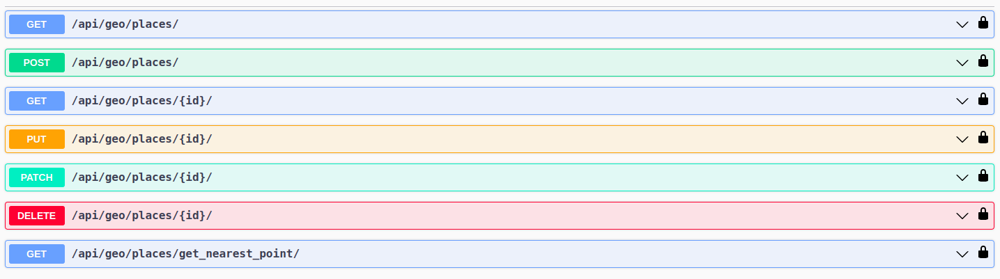

# The GeoPoint API project

The "GeoPoint" API project is an open-source REST API written in DRF and , which provides backend support 
for managing geospatial-related data in WSG84 coordinate system. 

It is built using DRF and PostGis extension, and includes features like "Place" management (CRUD) and searching nearest "Place"
to provided point coordinates. 
The project can be used to create, update, delete, and retrieve data through its various endpoints. 
Additionally, it includes automated testing to ensure its functionality.

# API features

- "Place" CRUD
- Searching nearest point 
- Searching nearest point inside certain radius 
- Admin panel at <span style="color: rgb(255, 76, 96);">/admin/<span> with interactive map 
- API documentation at <span style="color: rgb(255, 76, 96)">/api/doc/swagger/<span> 
- API documentation at <span style="color: rgb(255, 76, 96)">/api/doc/redoc/<span> 

# API endpoints


# Installation via GitHub


### Preparing stage
First of all you have to install geospatial libraries:
```shell
sudo apt-get update
sudo apt-get install python3-dev libpq-dev 
sudo apt-get install binutils libproj-dev gdal-bin
```

If you don't have PostgreSQL - [install it](https://www.postgresql.org/download/) or use some remote DB such as [Elephant](https://customer.elephantsql.com/)

When PostgreSQL is installed perform next steps:
1. Log into an interactive Postgres session by typing:
   ```shell
   sudo -u postgres psql
   ```
2. First, create a database.
   ```shell
   postgres=# CREATE DATABASE db_name;
   ```
3. Next, create a database user.
   ```shell
   postgres=# CREATE USER db_user WITH PASSWORD 'password';
   ```
4. Then, give our new user access to administer our new database:
   ```shell
   postgres=# GRANT ALL PRIVILEGES ON DATABASE db_name TO db_user;
   ```
5. Exit out of the PostgreSQL prompt by typing:
   ```shell
   postgres# \q
   ```
6. Install PostGIS apt package :
   ```shell
   sudo apt install postgis --no-install-recommends
   ```
7. Install the package that contains postgis.control manually :
   ```shell
   sudo apt-get install postgis postgresql-<POSTGRESQL_VERSION>-postgis-scripts
   ```
8. Create PostGIS Extension :
   ```shell
   sudo -u postgres psql
   postgres=# \c db_name
   db_name=# CREATE EXTENSION postgis;
   ```

### Project settings stage
```shell
git clone git@github.com:ZhAlexR/#
cd geo_point
python3 -m venv venv
source venv/bin/activete # for linux or macOS
venv\Scripts\activete # for Windows
pip install requirements.txt
```
>Pay attention! You have to set up ENVIRONMENT VARIABLES!!!

Create `.env` file inside your project root. Use `.env.semple` as template:
```shell
POSTGRES_HOST=POSTGRES_HOST
POSTGRES_NAME=POSTGRES_NAME
POSTGRES_USER=POSTGRES_USER
POSTGRES_PASSWORD=POSTGRES_PASSWORD

DJANGO_SECRET_KEY=DJANGO_SECRET_KEY
DEBUG=DEBUG
ALLOWED_HOSTS=ALLOWED_HOSTS
```
Change the part after `=` to your valid credentials, for example:
`POSTGRES_NAME=your_database_name`

Perform the next commands to create migrations for your DB:
```shell
python manage.py makemigration
python manage.py migrate
```

Start your server using:
```shell
python manage.py runserver
```


# Installation via Docker (strongly recommended!)

If you don't have Docker - [install it](https://docs.docker.com/get-docker/)
```shell
git clone git@github.com:ZhAlexR/#
cd geo_point
```

>Pay attention! You have to set up ENVIRONMENT VARIABLES!!!

Create `.env` file inside your project root. Use `.env.semple` as template:
```shell
POSTGRES_HOST=POSTGRES_HOST
POSTGRES_DB=POSTGRES_DB
POSTGRES_USER=POSTGRES_USER
POSTGRES_PASSWORD=POSTGRES_PASSWORD

DJANGO_SECRET_KEY=DJANGO_SECRET_KEY
DEBUG=DEBUG
ALLOWED_HOSTS=ALLOWED_HOSTS
```
Change the part after `=` to your valid credentials, for example:
`POSTGRES_DB=your_database_name`

```shell
docker compose build
docker coppose up
```
# <p style="text-align: center;">Enjoy your Cinema API!</p>

<div align="center">
    
</div>


